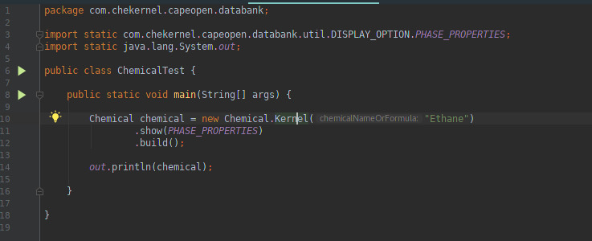

# CheKernel
> Chemical Engineering Kernel

 allows for importing CAPE-OPEN version 1.1 thermodynamic and physical Property Packages into C-Python for Windows.


Chemical Engineering Kernel provides full computational approach to 400 widely used chemicals



#maven user

```Java

<code>
   
        <dependency>
    	     <groupId>com.work-ps.chekernel</groupId>
    	     <artifactId>chekernel</artifactId>
   	     <version>1.0.0</version>
	</dependency>

 </code>


## Usage

```Java
package com.chekernel.capeopen.databank;

import static com.chekernel.capeopen.databank.util.DISPLAY_OPTION.ALL_INFORMATION;
import static java.lang.System.out;

public class ChemicalTest {

    public static void main(String[] args) {

        Chemical chemical = new Chemical.Kernel("Ethane")
                .show(ALL_INFORMATION)
                .build();

        out.println(chemical);

    }

}


```Java

        Chemical chemical = new Chemical.Kernel("Ethane")
                .show(PHASE_PROPERTIES)
                .build();


##Features


* Property Package Manager
	* ['casRegistryNumber', 'chemicalFormula', 'acentricFactor', 'charge', 'criticalDensity', 'criticalPressure', 'criticalTemperature', 'criticalVolume', 'dipoleMoment', 'molecularWeight', 'normalBoilingPoint']

* Multiflash Property Package Manager
	* ['vaporPressure', 'vaporPressure.Dtemperature', 'fugacityCoefficientOfVapor', 'heatCapacityOfLiquid', 'heatOfVaporization', 'surfaceTensionSatLiquid', 'thermalConductivityOfLiquid', 'thermalConductivityOfVapor', 'virialCoefficient', 'virialCoefficient.Dtemperature', 'idealGasEnthalpy', 'idealGasEnthalpy.Dtemperature', 'idealGasEntropy', 'idealGasHeatCapacity', 'viscosityOfLiquid', 'viscosityOfVapor', 'volumeChangeUponVaporization', 'volumeOfLiquid']

* constant_compound_properties
	* ['compressibility', 'compressibility.Dtemperature', 'compressibility.Dpressure', 'compressibility.Dmoles', 'compressibility.DmolFraction', 'compressibilityFactor', 'compressibilityFactor.Dtemperature', 'compressibilityFactor.Dpressure', 'compressibilityFactor.Dmoles', 'compressibilityFactor.DmolFraction', 'density', 'density.Dtemperature', 'density.Dpressure', 'density.Dmoles', 'density.DmolFraction', 'enthalpy', 'enthalpy.Dtemperature', 'enthalpy.Dpressure', 'enthalpy.Dmoles', 'enthalpy.DmolFraction', 'entropy', 'entropy.Dtemperature', 'entropy.Dpressure', 'entropy.Dmoles', 'entropy.DmolFraction', 'fugacity', 'fugacity.Dtemperature', 'fugacity.Dpressure', 'fugacity.Dmoles', 'fugacity.DmolFraction', 'fugacityCoefficient', 'fugacityCoefficient.Dtemperature', 'fugacityCoefficient.Dpressure', 'fugacityCoefficient.Dmoles', 'fugacityCoefficient.DmolFraction', 'gibbsEnergy', 'gibbsEnergy.Dtemperature', 'gibbsEnergy.Dpressure', 'gibbsEnergy.Dmoles', 'gibbsEnergy.DmolFraction', 'heatCapacityCp', 'heatCapacityCp.Dtemperature', 'heatCapacityCp.Dpressure', 'heatCapacityCp.Dmoles', 'heatCapacityCp.DmolFraction', 'heatCapacityCv', 'heatCapacityCv.Dtemperature', 'heatCapacityCv.Dpressure', 'heatCapacityCv.Dmoles', 'heatCapacityCv.DmolFraction', 'helmholtzEnergy', 'helmholtzEnergy.Dtemperature', 'helmholtzEnergy.Dpressure', 'helmholtzEnergy.Dmoles', 'helmholtzEnergy.DmolFraction', 'internalEnergy', 'internalEnergy.Dtemperature', 'internalEnergy.Dpressure', 'internalEnergy.Dmoles', 'internalEnergy.DmolFraction', 'jouleThomsonCoefficient', 'jouleThomsonCoefficient.Dtemperature', 'jouleThomsonCoefficient.Dpressure', 'jouleThomsonCoefficient.Dmoles', 'jouleThomsonCoefficient.DmolFraction', 'logFugacityCoefficient', 'logFugacityCoefficient.Dtemperature', 'logFugacityCoefficient.Dpressure', 'logFugacityCoefficient.Dmoles', 'logFugacityCoefficient.DmolFraction', 'speedOfSound', 'speedOfSound.Dtemperature', 'speedOfSound.Dpressure', 'speedOfSound.Dmoles', 'speedOfSound.DmolFraction', 'thermalConductivity', 'thermalConductivity.Dtemperature', 'thermalConductivity.Dpressure', 'thermalConductivity.Dmoles', 'thermalConductivity.DmolFraction', 'viscosity', 'viscosity.Dtemperature', 'viscosity.Dpressure', 'viscosity.Dmoles', 'viscosity.DmolFraction', 'volume', 'volume.Dtemperature', 'volume.Dpressure', 'volume.Dmoles', 'volume.DmolFraction', 'molecularWeight']

* temperature_dependent_compound_properties
	* ['vaporPressure', 'vaporPressure.Dtemperature', 'fugacityCoefficientOfVapor', 'heatCapacityOfLiquid', 'heatOfVaporization', 'surfaceTensionSatLiquid', 'thermalConductivityOfLiquid', 'thermalConductivityOfVapor', 'virialCoefficient', 'virialCoefficient.Dtemperature', 'idealGasEnthalpy', 'idealGasEnthalpy.Dtemperature', 'idealGasEntropy', 'idealGasHeatCapacity', 'viscosityOfLiquid', 'viscosityOfVapor', 'volumeChangeUponVaporization', 'volumeOfLiquid']

* phase_properties
	* ['compressibility', 'compressibility.Dtemperature', 'compressibility.Dpressure', 'compressibility.Dmoles', 'compressibility.DmolFraction', 'compressibilityFactor', 'compressibilityFactor.Dtemperature', 'compressibilityFactor.Dpressure', 'compressibilityFactor.Dmoles', 'compressibilityFactor.DmolFraction', 'density', 'density.Dtemperature', 'density.Dpressure', 'density.Dmoles', 'density.DmolFraction', 'enthalpy', 'enthalpy.Dtemperature', 'enthalpy.Dpressure', 'enthalpy.Dmoles', 'enthalpy.DmolFraction', 'entropy', 'entropy.Dtemperature', 'entropy.Dpressure', 'entropy.Dmoles', 'entropy.DmolFraction', 'fugacity', 'fugacity.Dtemperature', 'fugacity.Dpressure', 'fugacity.Dmoles', 'fugacity.DmolFraction', 'fugacityCoefficient', 'fugacityCoefficient.Dtemperature', 'fugacityCoefficient.Dpressure', 'fugacityCoefficient.Dmoles', 'fugacityCoefficient.DmolFraction', 'gibbsEnergy', 'gibbsEnergy.Dtemperature', 'gibbsEnergy.Dpressure', 'gibbsEnergy.Dmoles', 'gibbsEnergy.DmolFraction', 'heatCapacityCp', 'heatCapacityCp.Dtemperature', 'heatCapacityCp.Dpressure', 'heatCapacityCp.Dmoles', 'heatCapacityCp.DmolFraction', 'heatCapacityCv', 'heatCapacityCv.Dtemperature', 'heatCapacityCv.Dpressure', 'heatCapacityCv.Dmoles', 'heatCapacityCv.DmolFraction', 'helmholtzEnergy', 'helmholtzEnergy.Dtemperature', 'helmholtzEnergy.Dpressure', 'helmholtzEnergy.Dmoles', 'helmholtzEnergy.DmolFraction', 'internalEnergy', 'internalEnergy.Dtemperature', 'internalEnergy.Dpressure', 'internalEnergy.Dmoles', 'internalEnergy.DmolFraction', 'jouleThomsonCoefficient', 'jouleThomsonCoefficient.Dtemperature', 'jouleThomsonCoefficient.Dpressure', 'jouleThomsonCoefficient.Dmoles', 'jouleThomsonCoefficient.DmolFraction', 'logFugacityCoefficient', 'logFugacityCoefficient.Dtemperature', 'logFugacityCoefficient.Dpressure', 'logFugacityCoefficient.Dmoles', 'logFugacityCoefficient.DmolFraction', 'speedOfSound', 'speedOfSound.Dtemperature', 'speedOfSound.Dpressure', 'speedOfSound.Dmoles', 'speedOfSound.DmolFraction', 'thermalConductivity', 'thermalConductivity.Dtemperature', 'thermalConductivity.Dpressure', 'thermalConductivity.Dmoles', 'thermalConductivity.DmolFraction', 'viscosity', 'viscosity.Dtemperature', 'viscosity.Dpressure', 'viscosity.Dmoles', 'viscosity.DmolFraction', 'volume', 'volume.Dtemperature', 'volume.Dpressure', 'volume.Dmoles', 'volume.DmolFraction', 'molecularWeight']

* phase_pair_properties
	* ['kvalue', 'kvalue.Dtemperature', 'kvalue.Dpressure', 'kvalue.Dmoles', 'kvalue.DmolFraction', 'logKvalue', 'logKvalue.Dtemperature', 'logKvalue.Dpressure', 'logKvalue.Dmoles', 'logKvalue.DmolFraction', 'surfaceTension', 'surfaceTension.Dtemperature', 'surfaceTension.Dpressure', 'surfaceTension.Dmoles', 'surfaceTension.DmolFraction']

* phase_equilibrium_properties
	* ['temperature', 'pressure', 'vaporFraction', 'enthalpy', 'entropyF', 'volume']

* constant_properties
	*['casRegistryNumber', 'chemicalFormula', 'acentricFactor', 'charge', 'criticalDensity', 'criticalPressure', 'criticalTemperature', 'criticalVolume', 'dipoleMoment', 'molecularWeight', 'normalBoilingPoint']

 

## License

Distributed under the A.B Inc license. See ``LICENSE`` for more information.

[https://work-ps.com/license](/)

## Team

 <li>Amuda A. Badmus </li>
